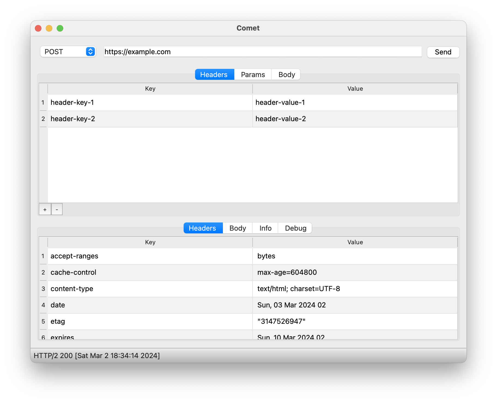
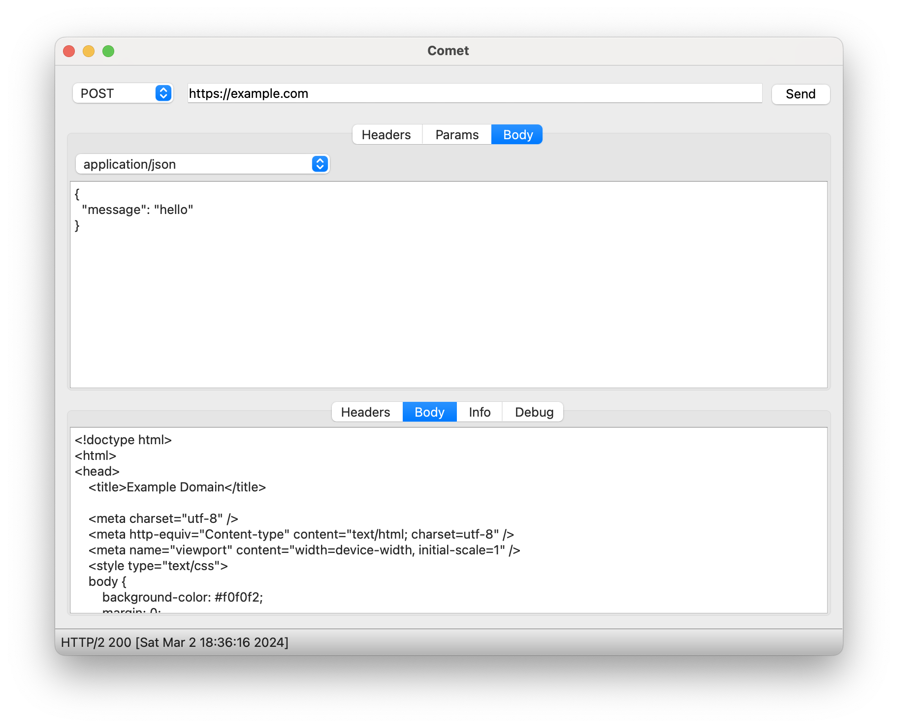
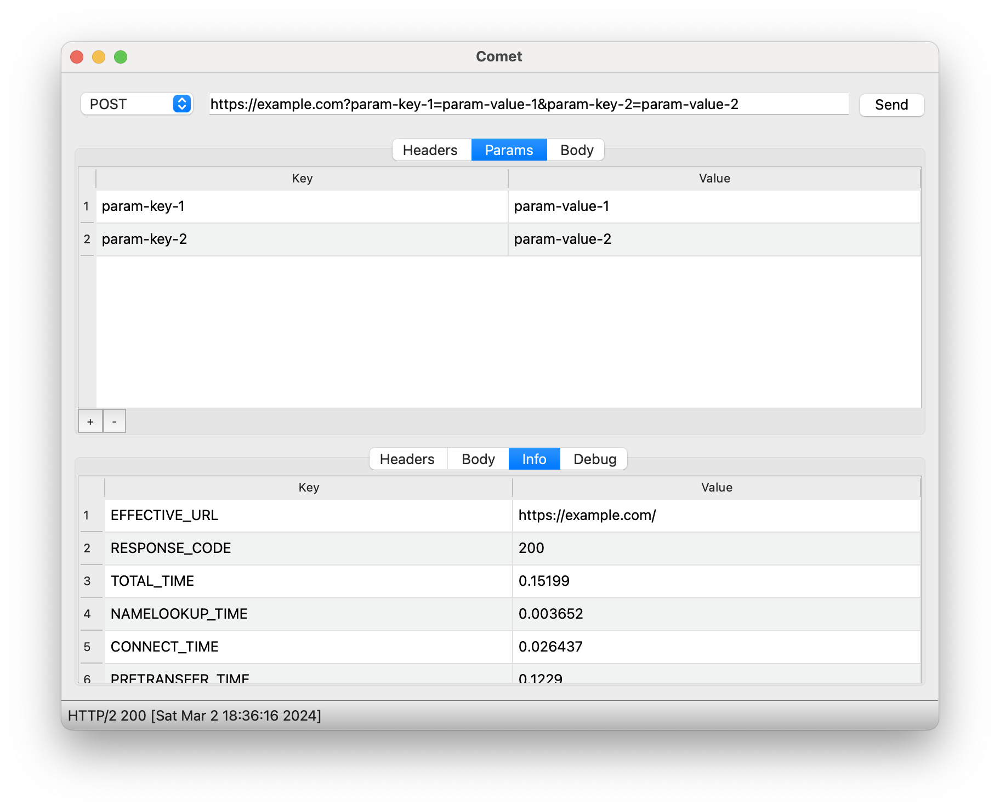
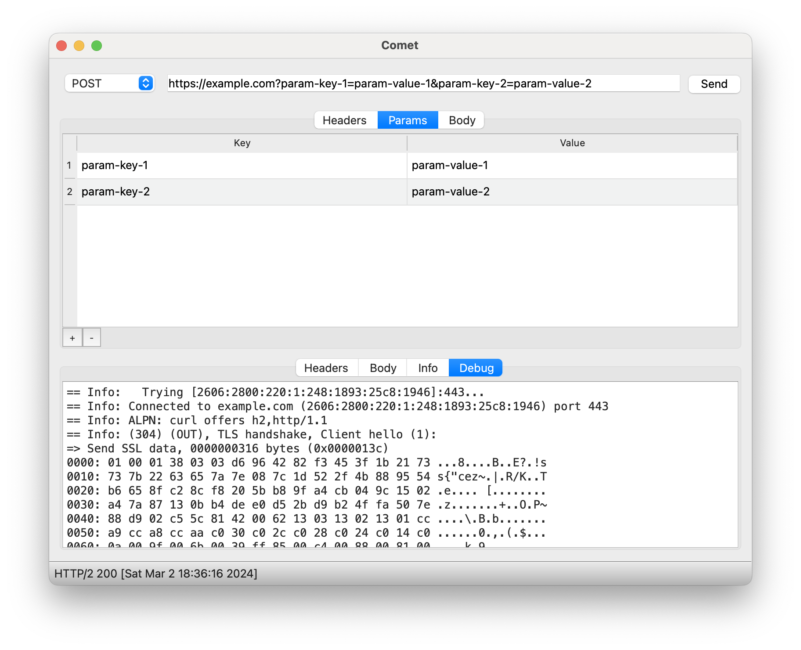

# Comet

Comet is an API client for sending HTTP requests

## Table of Contents

1. [Features](#features)
1. [Screenshots](#screenshots)
1. [Installation](#installation)
1. [Build](#build)

## Features

- Fast
- Native application
- Low memory footprint
- Cross-platform
- Open source
- Local only / no phoning home

## Screenshots






## Installation

### macOS

- Download the latest QDirStat dmg file from the [releases page](https://github.com/jesusha123/comet/releases) 
- Open the dmg file and drag Comet.app to the Applications folder

## Build

- Install Qt 6 SDK
- Install CMake
- Generate Makefile
```sh
# Single arch
cmake .

# Universal macOS build
cmake . -DCMAKE_OSX_ARCHITECTURES="x86_64;arm64"
```
- Make application
```sh
make
```
- Run application
```sh
# macOS
open ./Comet.app
```
